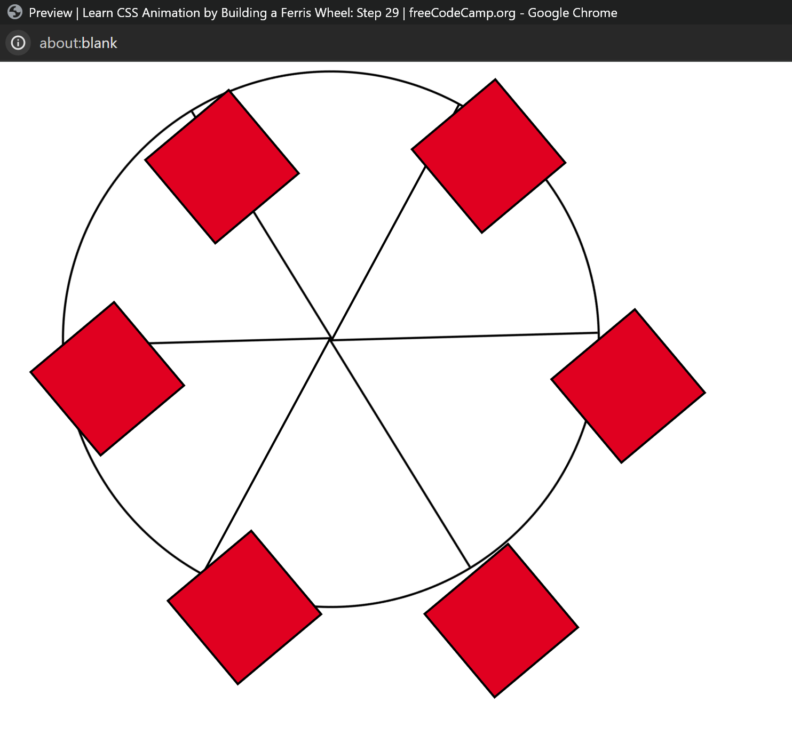

# Ferris Wheel Project

This project, inspired by the FreeCodeCamp curriculum, demonstrates the implementation of CSS animations to create an engaging Ferris wheel effect on a webpage. By leveraging CSS animation techniques, elements are transformed and animated to draw attention to specific sections, enhancing the overall user experience.

## Demo Video

Click the image above to watch a demo of the Ferris wheel project.

## Key Features

- Utilizes CSS animations for dynamic element transformations.
- Demonstrates the use of CSS to create engaging visual effects.
- Enhances webpage interactivity and engagement through animation.

## Technologies Used

- HTML5
- CSS3

## How to Use

1. Clone the repository to your local machine.
2. Open the `index.html` file in a web browser to view the Ferris wheel effect.

## Contributing

Contributions are welcome! If you'd like to contribute to further improvements or add new features, feel free to submit a pull request.
